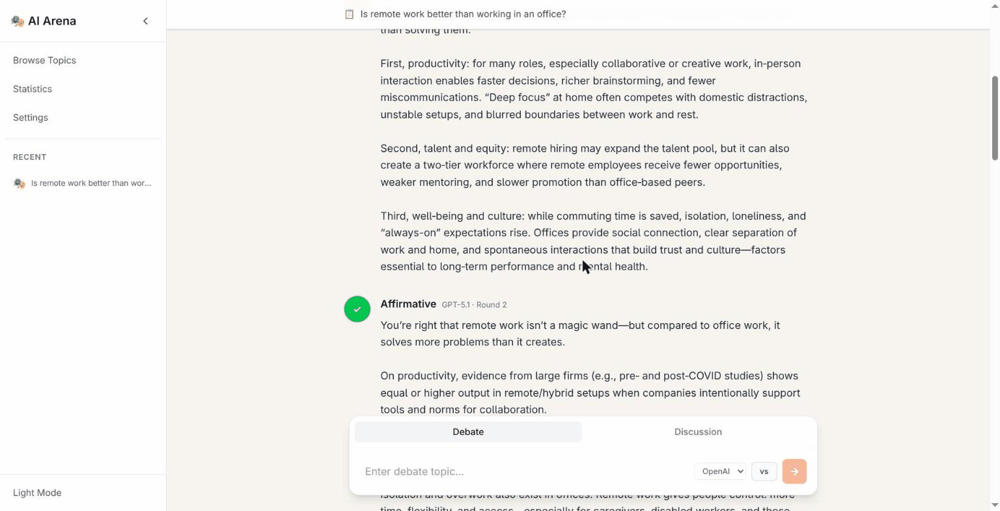

# 🎭 AI Debate Arena

A web application where AI models (OpenAI GPT-5.1, Anthropic Claude Sonnet 4.5, and Google Gemini 3) engage in structured debates and collaborative discussions.

**Live Demo:** https://aidebatearena.vercel.app



---

## 🌟 Features

### Debate Mode
- **AI vs AI Debates** - Watch different AI models argue opposing sides
- **Multi-Round Structure** - Opening statements, rebuttals, and closing arguments
- **AI Moderator** - Claude monitors debates for logical fallacies and bias
- **Judge Panel** - Three AI judges independently evaluate and vote on winners
- **Real-Time Streaming** ⚡ - See responses as they generate (1-2 seconds instead of 10+)

### Discussion Mode
- **3-Way Collaboration** - GPT, Claude, and Gemini discuss topics together
- **Consensus Detection** - Automatically identifies when all models agree
- **Judge Resolution** - If no consensus, judges vote on the best perspective
- **Progressive Rendering** - Watch the conversation unfold in real-time

### User Experience
- **True Streaming** ⚡ NEW! - Responses appear immediately as AI generates them
- **Mobile Responsive** - Optimized for all screen sizes
- **Dark/Light Themes** - Toggle between comfortable viewing modes
- **Debate History** - Save and revisit past debates
- **Firebase Authentication** - Google sign-in and email/password support

---

## 🚀 Tech Stack

### Frontend
- **React** with TypeScript
- **Vite** for blazing-fast dev and build
- **Tailwind CSS** for styling
- **Firebase** for authentication
- **SSE (Server-Sent Events)** for real-time streaming

### Backend
- **Node.js** with Express
- **TypeScript** for type safety
- **OpenAI API** (GPT-5.1)
- **Anthropic API** (Claude Sonnet 4.5)
- **Google Generative AI** (Gemini 3)
- **SSE Streaming** for real-time updates

### Deployment
- **Frontend:** Vercel
- **Backend:** Render
- **CI/CD:** Auto-deploy on push to main

---

## 📦 Installation

### Prerequisites
- Node.js 18+ installed
- API keys for OpenAI, Anthropic, and Google AI
- Firebase project (for authentication)

### Clone Repository
```bash
git clone https://github.com/yourusername/debate-arena.git
cd debate-arena
```

### Backend Setup
```bash
# Install dependencies
npm install

# Create .env file
cp .env.example .env

# Add your API keys to .env
OPENAI_API_KEY=sk-...
ANTHROPIC_API_KEY=sk-ant-...
GOOGLE_API_KEY=AI...
PORT=5050
```

### Frontend Setup
```bash
cd debate-ui
npm install

# Create .env file
echo "VITE_API_BASE_URL=http://localhost:5050" > .env

# Add Firebase config to src/firebase.ts
```

---

## 🎮 Usage

### Start Development Servers

**Quick Start (Windows):**
```bash
start.bat
```

**Manual Start:**
```bash
# Terminal 1: Backend
npm run dev

# Terminal 2: Frontend
cd debate-ui
npm run dev
```

Open http://localhost:5173

### Run a Debate
1. Enter a debate topic (e.g., "AI will replace human jobs")
2. Select models for affirmative and negative sides
3. Click "Start Debate"
4. Watch as responses stream in real-time! ⚡

### Run a Discussion
1. Switch to "Discussion" mode
2. Enter a topic (e.g., "What is consciousness?")
3. Click "Start Discussion"
4. Watch three AIs collaborate to find consensus

---

## 🏗️ Project Structure

```
debate-arena/
├── src/                          # Backend source
│   ├── lib/
│   │   ├── ai/                   # AI provider integrations
│   │   │   ├── openai.ts        # OpenAI + streaming
│   │   │   ├── anthropic.ts     # Claude + streaming
│   │   │   └── gemini.ts        # Gemini + streaming
│   │   ├── debate/               # Core debate logic
│   │   │   ├── debate-controller-v2.ts
│   │   │   ├── discussion-controller.ts
│   │   │   └── judging.ts
│   │   └── config/               # Configuration
│   └── server.ts                 # Express server with SSE
├── debate-ui/                    # Frontend
│   ├── src/
│   │   ├── components/          # React components
│   │   ├── auth/                # Firebase authentication
│   │   ├── App.tsx              # Main app with streaming
│   │   └── types.ts             # TypeScript types
│   └── public/                   # Static assets
├── STREAMING_IMPLEMENTATION.md   # Technical docs
├── TEST_STREAMING.md            # Testing guide
└── DEPLOY_NOW.md                # Deployment guide
```

---

## 🔥 Recent Updates

### ⚡ True Streaming (Latest)
**Time-to-first-token dropped from ~10-15s to ~1-2s** by switching from buffered
responses to token-level SSE streaming:
- Text streams progressively as the AI generates it (instead of waiting for the full response)
- Matches the ChatGPT/Claude typing experience
- Works in both debate and discussion modes

**Technical Implementation:**
- Backend streams chunks via async generators
- SSE sends chunk events in real-time
- Frontend appends chunks immediately
- Works in both debate and discussion modes

See `STREAMING_IMPLEMENTATION.md` for technical details.

---

## 🚢 Deployment

### Production Deployment

**Backend (Render):**
1. Connect GitHub repo to Render
2. Set environment variables (API keys)
3. Auto-deploys on push to main

**Frontend (Vercel):**
1. Connect GitHub repo to Vercel
2. Set root directory to `debate-ui`
3. Set `VITE_API_BASE_URL` environment variable
4. Auto-deploys on push to main

### Manual Deployment
```bash
# Build backend
npm run build

# Build frontend
cd debate-ui
npm run build

# Deploy dist folders to your hosting service
```

---

## 🧪 Testing

### Local Testing
```bash
# Run the quick start script
start.bat

# Or test builds
npm run build
cd debate-ui && npm run build
```

### Streaming Feature Test
See `TEST_STREAMING.md` for comprehensive testing guide.

**Quick test:**
1. Start a debate
2. Watch for text appearing within 1-2 seconds
3. Verify progressive streaming (not all-at-once)
4. Check console for errors (should be none)

---

## 🐛 Troubleshooting

### Common Issues

**"No response from AI"**
- Check API keys in `.env` file
- Verify API credits/quota
- Check console for specific error messages

**"Streaming not working"**
- Clear browser cache
- Check Network tab for SSE connection
- Verify `VITE_API_BASE_URL` is set correctly

**"Build errors"**
- Delete `node_modules` and run `npm install` again
- Ensure Node.js version is 18+
- Check for TypeScript errors with `npm run build`

---

## 🤝 Contributing

Contributions welcome! Please:
1. Fork the repository
2. Create a feature branch
3. Make your changes
4. Test thoroughly
5. Submit a pull request

---

## 📄 License

MIT License - feel free to use this project for learning or commercial purposes.

---

## 🙏 Acknowledgments

- **OpenAI** for GPT-5.1 API
- **Anthropic** for Claude API
- **Google** for Gemini API
- **Vercel** for frontend hosting
- **Render** for backend hosting

---

## 📞 Support

For issues or questions:
- Open a GitHub issue
- Check existing documentation
- Review `STREAMING_IMPLEMENTATION.md` for technical details

---

**Built with ❤️ using React, TypeScript, and the power of AI**

🚀 **Try it live:** https://aidebatearena.vercel.app
